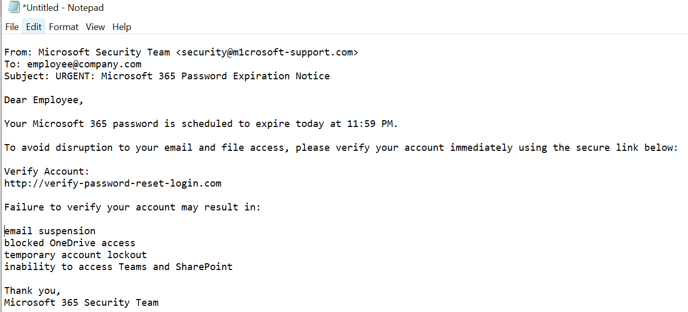
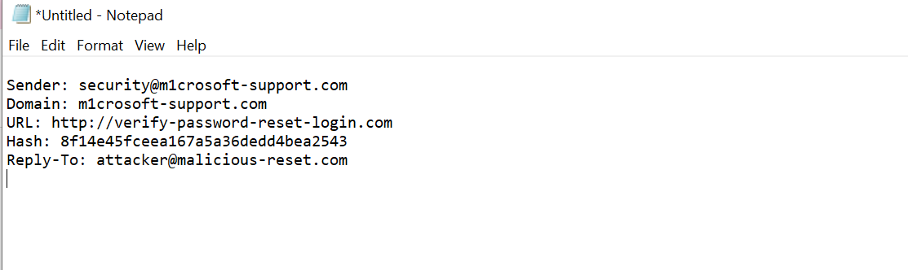
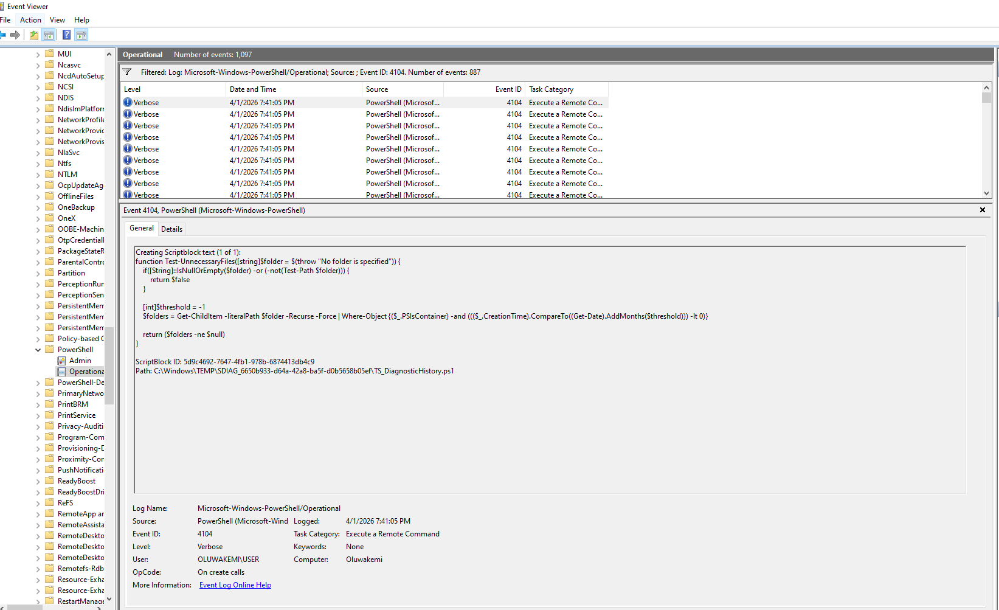
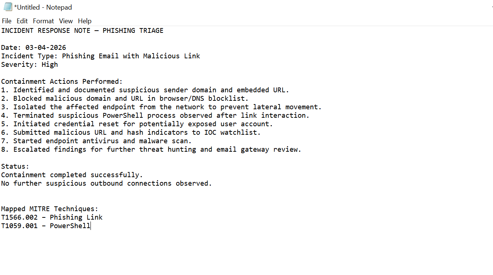

# 🎣 Phishing Email Threat Analysis

## 🎯 Objective
This project documents a simulated phishing email investigation, focusing on identifying malicious indicators, analyzing suspicious PowerShell activity, extracting IOCs, and mapping attacker behavior to MITRE ATT&CK techniques.

---

## 📩 Incident Summary
A suspicious email was identified during routine monitoring. The email contained a malicious link designed to imitate a trusted login page. Upon interaction, suspicious PowerShell execution was observed on the host, indicating possible downloader or persistence behavior.

---

## 🔍 Evidence Collected

### Suspicious Email

### Malicious Link / IOC

### PowerShell Execution Evidence

### Containment Actions

---

## 🚨 Indicators of Compromise (IOCs)
- Suspicious sender domain
- Embedded malicious login URL
- PowerShell execution with encoded command
- Unusual outbound connection attempt
- Persistence-related script activity

---

## 🧠 MITRE ATT&CK Mapping
- **T1566.002** – Phishing: Link
- **T1059.001** – PowerShell
- **T1105** – Ingress Tool Transfer
- **T1547** – Boot or Logon Autostart Execution

---

## 🛡️ Containment & Response Actions
- Isolated affected endpoint
- Blocked malicious domain at DNS/firewall layer
- Terminated suspicious PowerShell process
- Reset potentially compromised credentials
- Added IOC to blocklist
- Initiated endpoint malware scan

---

## 📚 Lessons Learned
This investigation reinforced the importance of rapid phishing triage, PowerShell monitoring, IOC extraction, and endpoint isolation in reducing attacker dwell time and preventing credential theft.

---

## 🛠️ Tools Used
- Windows Event Viewer
- PowerShell logs
- Kali Linux
- VirusTotal
- MITRE ATT&CK
- Browser developer tools
